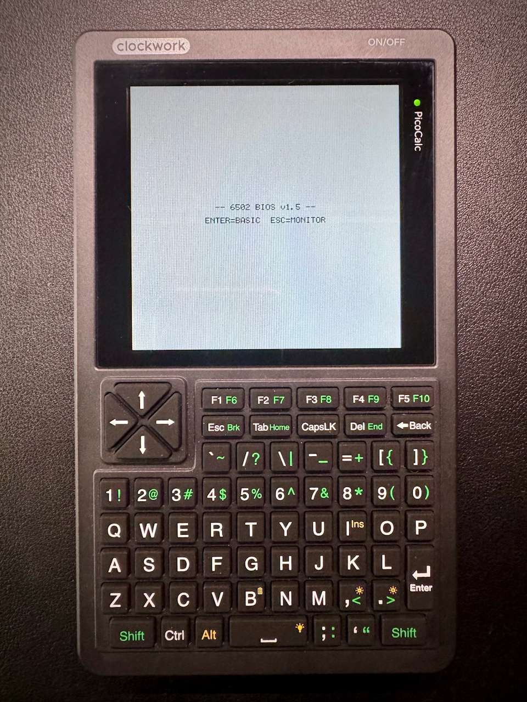

# 6502-PICOCALC



The **[A.C. Wright AC6502](https://github.com/acwright/6502-ACE)** — a 65C02
machine with a TMS9918 VDP, a SID, a 6522 VIA, a 6551 ACIA, a DS1511Y clock and
a CompactFlash card — running on a
[ClockworkPi PicoCalc](https://www.clockworkpi.com/picocalc), as a complete
replacement for the device firmware.

One `.uf2`, no host needed: it boots the real 32 KB BIOS ROM byte-for-byte,
probes its I/O slots, shows the splash, and drops into BASIC.

> 📖 **Guide:** [AC6502 Documentation](https://acwright.github.io/6502-DOCS/) —
> the user's and programmer's guide for the whole family. Everything the machine
> itself does — BASIC, the Monitor, the BIOS calls, the I/O cards — is documented
> there; this README covers only what is particular to the PicoCalc port.

---

## Hardware Emulation

The same machine the desktop emulator runs, on two RP2040/RP2350 cores: Core 0
is the 6502 and its I/O cards, Core 1 rasterises the VDP to the LCD and
synthesises the SID.

| Component | Details |
|---|---|
| **CPU** | W65C02S via [vrEmu6502](https://github.com/visrealm/vrEmu6502), full opcode set, IRQ / NMI |
| **RAM** | 32 KB system RAM + banked expansion (see [Pico 1 vs Pico 2](#pico-1-vs-pico-2)) |
| **ROM** | 32 KB BIOS in flash, replaceable from the SD card |
| **Video** | TMS9918A VDP, 16 KB VRAM — rendered to the PicoCalc's 320×320 LCD |
| **Audio** | MOS 6581 SID — synthesised to the PWM speaker pins |
| **Serial** | 6551 ACIA — bridged to USB CDC *and* the side-header UART, both live at once |
| **Storage** | CompactFlash 8-bit IDE — `CF.IMG` on the SD card, 256 × 1 MB banks |
| **RTC / NVRAM** | DS1511Y+ — clock plus 256 B of NVRAM, kept in flash |
| **GPIO** | 6522 VIA — keyboard on port B, fed from the PicoCalc's I2C keyboard, plus a joystick on each port |

Two places knowingly differ from the reference: the VDP status register's
fifth-sprite and collision bits always read 0 (sprites are rasterised on the
other core), and the emulated CPU is not paced to a fixed clock rate — it runs
as fast as the board manages. Nothing in the BIOS or BASIC depends on either.

---

## Requirements

- A Pico SDK toolchain (`arm-none-eabi-gcc`), CMake, and Ninja.
- The SDK itself is vendored in `pico-sdk/`, so there is nothing to fetch.

`build.sh` sets `PICO_SDK_PATH` for you and prepends the toolchain to `PATH`.
It defaults to `~/toolchains/arm-gnu-toolchain-15.2.rel1-darwin-arm64-arm-none-eabi/bin`
(a plain tarball extract — the Homebrew cask installs via a GUI pkg installer
that can't be authorised headlessly). Point `TOOLCHAIN_BIN` somewhere else if
yours lives elsewhere:

```sh
TOOLCHAIN_BIN=/path/to/arm-none-eabi/bin ./build.sh
```

## Building

```sh
./build.sh          # both boards
./build.sh pico     # just the Pico 1 (RP2040)
./build.sh pico2    # just the Pico 2 (RP2350)
```

The board name is passed straight through as `PICO_BOARD`. Output lands in:

- `build/6502-picocalc-pico.uf2` — Pico 1 / RP2040
- `build/6502-picocalc-pico2.uf2` — Pico 2 / RP2350

## Flashing

1. Unplug the Pico, hold **BOOTSEL**, and plug it back in.
2. It mounts as a USB drive (`RPI-RP2` on a Pico 1, `RP2350` on a Pico 2).
3. Copy the matching `.uf2` onto it. The board reboots into the firmware by
   itself.

**Flash the UF2 that matches your board** — they are not interchangeable, and
each board only accepts its own. If you are unsure which one is already on a
board, open a serial terminal: the banner names it.

```
6502-PICOCALC (board=pico, clk_sys=200000 kHz)
```

---

## SD card

The launcher expects three folders, and offers to create any that are missing:

```
/Programs     .bas / .prg program images, loaded to $0800
/Carts        16 KB or 32 KB cartridge images, mapped at $C000
/ROMs         32 KB BIOS replacements
/CF.IMG       the emulated CompactFlash card (created on first boot)
```

`CF.IMG` is what BASIC's `LOAD`, `SAVE`, `DIR` and `BLOAD`/`BSAVE` work
against. It starts one 1 MB disk bank long and grows a bank at a time as
higher disks are used, so all 256 are addressable without pre-filling 256 MB
over SPI. Images can also be built on a desktop with
[`cffs`](https://github.com/acwright/cffs).

FatFs is built without long-name support, so files list under their 8.3 short
names — `Space Invaders.bas` appears as `SPACEI~1.BAS` and loads fine that way.

## First boot

The mainboard's power rail — LCD, keyboard controller, SD slot — only comes up
when the PicoCalc's **power button** is pressed. If you power the Pico module
through its own USB port (for the serial console), the RP2040 starts running
several seconds before the rest of the board exists. The firmware waits for the
keyboard controller to answer before touching the SD card, so this resolves
itself; the wait shows up in the boot log and is not an error:

```
boot: kbd_wait_ready           t+4492ms
```

If the controller never answers, it gives up after 5 seconds and carries on, so
a bare Pico with no PicoCalc attached still boots.

---

## Controls

**F1** opens the launcher at any time — even if a cartridge has hung the
machine, since it runs outside the emulated CPU. From there you can load
programs, cartridges and ROMs, eject what's in a slot, change settings, and
reset.

In the launcher: arrows move, **Enter** selects, **Esc** goes back. On the
settings screen, **Left/Right** change the highlighted value.

Two ways to restart the machine, matching the desktop emulator:

- **Reset machine** — the reset button. RAM keeps its contents, so a BASIC
  program in memory survives and can be `RUN` again.
- **Power cycle** — as if the power had been off. RAM is cleared and BASIC
  comes up cold.

Anything saved to `CF.IMG` survives both, as does whatever is in the ROM socket
and cartridge slot — those live in flash, like the chips they stand in for.

## Settings

Stored in flash and applied on every boot:

| Setting | Notes |
|---|---|
| Clock speed | Stock or 200 MHz. Takes effect on the next power-on. |
| Expansion RAM | Narrows the IO 1 card below what the build fitted. |
| Backlight | Applied as you adjust it. |
| Sleep after | Blanks the backlight when idle; any key brings it back. The machine keeps running. |

Sleep is a backlight blank, not a suspend — the 6502 carries on, audio keeps
playing, and the serial console stays live.

---

## Pico 1 vs Pico 2

Both are supported and boot the same machine. The differences come from SRAM:

|  | Pico 1 (RP2040) | Pico 2 (RP2350) |
|---|---|---|
| SRAM | 264 KB | 520 KB |
| Expansion RAM (IO 1) | 16 banks / 16 KB | 256 banks / 256 KB |
| Expansion RAM (IO 2) | absent | absent |

The BIOS probes every slot, so both boot correctly — only the amount of paged
RAM differs, and `MEM` reports what answered. BASIC itself only ever uses
BANK 0, which lives in system RAM, so it is unaffected either way.

**On speed:** the BIOS ROM is read from flash over XIP rather than copied into
RAM (there isn't room on either board — see the note in
[`src/machine/machine.c`](src/machine/machine.c)), which is the dominant cost in
the emulated CPU's throughput. Expect a boot-to-BASIC of around 30 seconds on a
Pico 1 rather than the second or two the real hardware takes. It is slow, but
it is stable, and everything else works as it should.

---

## Project Structure

```
src/
  cpu/vrEmu6502/  Troy Schrapel's 6502 core, vendored
  machine/        The machine: bus, cards (video, sound, serial, via, rtc,
                  storage, ram_bank), media, settings, and the Core 1
                  video rasteriser and SID synthesiser
  rom/            The BIOS image, embedded in flash
  lcd/  kbd/  sd/ PicoCalc hardware drivers (SPI panel, I2C keyboard, SD)
  fatfs/          FatFs, for the SD card
  launcher/       The F1 launcher — file browser, slots, settings
  main.c          Boot, the Core 0 run loop, and the USB CDC console
```

---

## Related

- [6502-ACE](https://github.com/acwright/6502-ACE) — the real machine, and the index of the whole family
- [6502-DOCS](https://github.com/acwright/6502-DOCS) — the user's and programmer's guide ([read it here](https://acwright.github.io/6502-DOCS/))
- [6502-BIOS](https://github.com/acwright/6502-BIOS) — firmware source; the ROM embedded here is built from it
- [6502-EMULATOR](https://github.com/acwright/6502-EMULATOR) — the desktop and web emulator, and the reference this port's I/O cards match
- [6502-DEV](https://github.com/acwright/6502-DEV) — the Teensy development firmware this port's structure came from
- [6502-PRG](https://github.com/acwright/6502-PRG) / [6502-CRT](https://github.com/acwright/6502-CRT) — templates for the programs and cartridges the launcher loads
- [6502-ASM](https://github.com/acwright/6502-ASM) / [6502-BAS](https://github.com/acwright/6502-BAS) — example programs and BASIC listings to run
- [cffs](https://github.com/acwright/cffs) — builds the `CF.IMG` CompactFlash images
- [bastok](https://github.com/acwright/bastok) — tokenizes BASIC listings into the `.prg` images the launcher accepts

## Credits

- 6502 core: [vrEmu6502](https://github.com/visrealm/vrEmu6502) by Troy Schrapel (MIT)
- LCD, keyboard and SD reference code: [clockworkpi/PicoCalc](https://github.com/clockworkpi/PicoCalc)
- SD card filesystem: [FatFs](http://elm-chan.org/fsw/ff/) by ChaN

## Contributing

This port pairs with the hardware, firmware and emulator linked above.
Contributions, issues, and feature requests are welcome!
